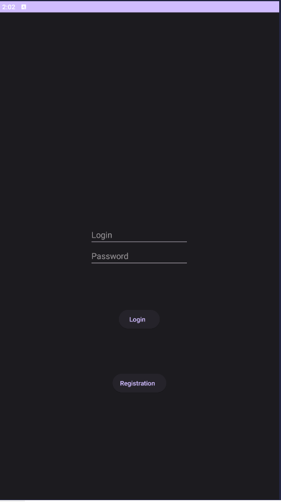
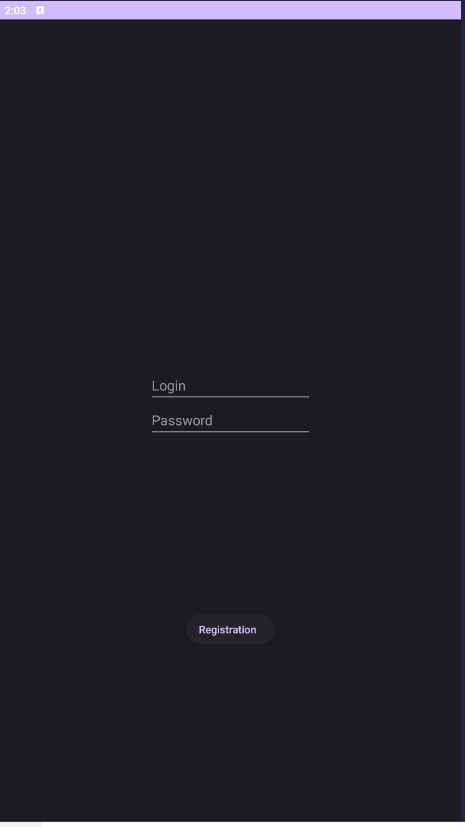
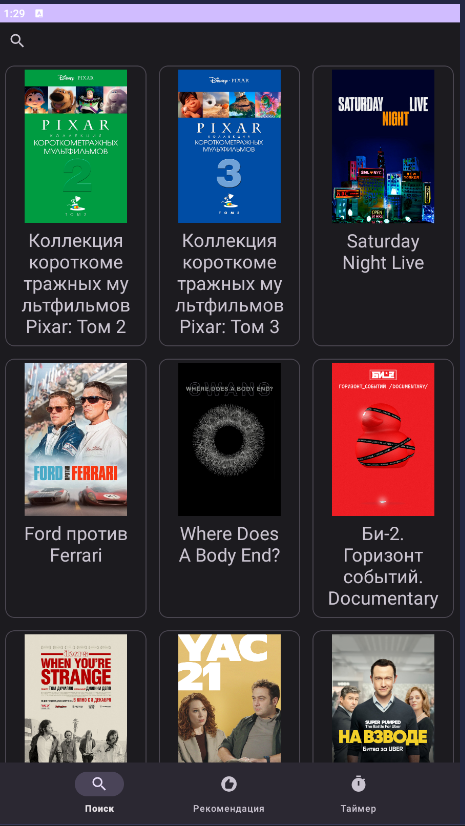
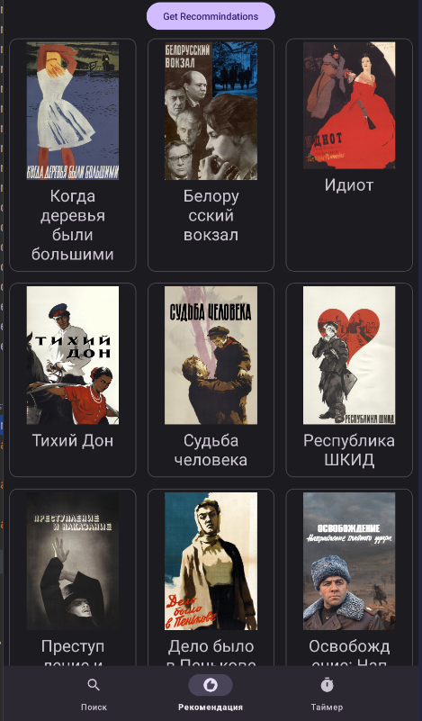
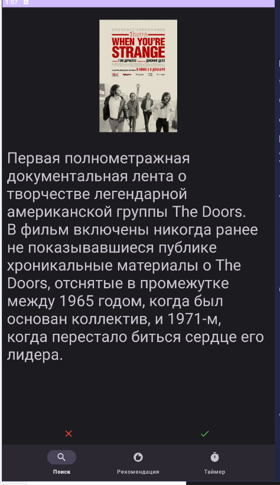
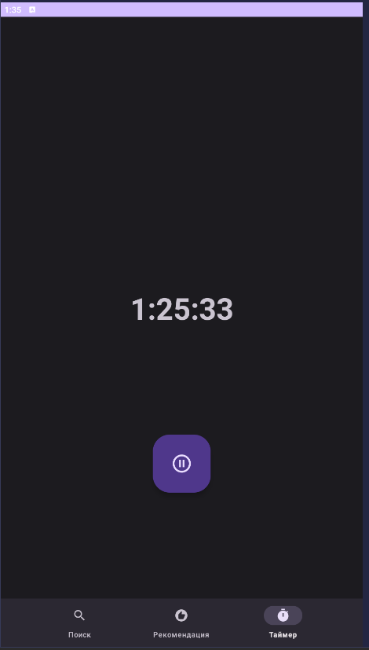

# MIREA_Kurs_4_sem
Реализация клиентской части рекомендательной системы (https://github.com/yarosshest/RecomApi)

# API

В api используется Retrofit2 и CokieManager для хранения koekies.
Настройка Retrofit2 в [RetrofitHelper.kt](app/src/main/java/com/example/mirea_kurs_4_sem/api/RetrofitHelper.kt)

# Экраны

## Экран авторизации

Реализован в [Login](app/src/main/java/com/example/mirea_kurs_4_sem/aftorization/Login.kt)

Простой экран на котором пользователь либо авторизуется, либо переходит
на экран регистрации.
При авторизации отправляется запрос на сервер, если пользователь с
такими данными существует, то он переходит на главный экран приложения,
иначе выводится сообщение об ошибке.

## Экран регистрации

Реализован в [Register.kt](app/src/main/java/com/example/mirea_kurs_4_sem/aftorization/Register.kt)

Простой экран на котором пользователь регистрируется.
При регистрации отправляется запрос на сервер, если пользователь с
такими данными не существует, то он переходит на главный экран
приложения, иначе выводится сообщение об ошибке.

## Главное активити

Реализовано в [MainAppActivity.kt](app/src/main/java/com/example/mirea_kurs_4_sem/MainAppActivity.kt)

В этом активити реализована навигация по приложению с помощью
BottomNavigationView.

## Экран поиска

Реализован в [FindFragment.kt](app/src/main/java/com/example/mirea_kurs_4_sem/find/FindFragment.kt)

Пользователь может ввести название фильма и нажать на кнопку поиска.
При нажатии на кнопку поиска отправляется запрос на сервер, если фильм
с таким названием существует, то он выводится на экран, иначе выводится
сообщение об ошибке.

При нажатии на фильм, пользователь переходит на экран с подробной
информацией и возможностью оценить фильм.

## Экран рекомендаций

Реализованно в [RecommendationFragment.kt](app/src/main/java/com/example/mirea_kurs_4_sem/recommendation/RecommendationFragment.kt)

Пользователь может посмотреть список рекомендованных фильмов.
При нажатии на фильм, пользователь переходит на экран с подробной
информацией и возможностью оценить фильм.

Если пользователь оценил меньше 2 фильмов, как положительные или
отрицательные, то пользователю выводится сообщение о том, что ему нужно
оценить больше фильмов.

## Экран с подробной информацией о фильме

Реализованно в [ProductFragment.kt](app/src/main/java/com/example/mirea_kurs_4_sem/ProductFragment.kt)

Пользователь может посмотреть подробную информацию о фильме, а также
оценить фильм.

## Экран таймера

Реализованно в [TimerFragment.kt](app/src/main/java/com/example/mirea_kurs_4_sem/timer/TimerFragment.kt)

На данном экране пользователь может поставить таймер контроля времени,
которое он хочет выделить на просмотр фильма.
Пользователь может поставить время, остановить и запустить таймер.

# Сохранение RecyclerView

Реализованно в [AppViewModel.kt](app/src/main/java/com/example/mirea_kurs_4_sem/AppViewModel.kt)

Для сохранения RecyclerView используется viewmodel.
В которой хранится MutableLiveData с данными.
Которые нужно отобразить в RecyclerView.

# Работа таймера

Реализованно в [TimerService.kt](app/src/main/java/com/example/mirea_kurs_4_sem/timer/TimerService.kt)

Для работы таймера используется сервис.
В котором реализован таймер и уведомления через NotificationManager
и CountDownTimer.

[TimerFragment.kt](app/src/main/java/com/example/mirea_kurs_4_sem/timer/TimerFragment.kt)
подписывается на изменения таймера через broadcastReceiver.

Для сохранения broadcastReceiver используется sharedPreferences.

При паузе таймера, сервис удаляется, а при возобновлении таймера, сервис
создается заново.
Сохранение состояния таймера реализовано через sharedPreferences.